# Nama: Raihan Ardiansyah
# Nim: 312410396
# Kelas: I241C
# Matkul: Pemrograman Web 2

## Langkah-Langkah Praktikum 1
Mengaktifkan ekstensi yang diperlukan melalui XAMPP Control Panel. pilih bagian Apache lalu klik Config/PHP.ini.
##### 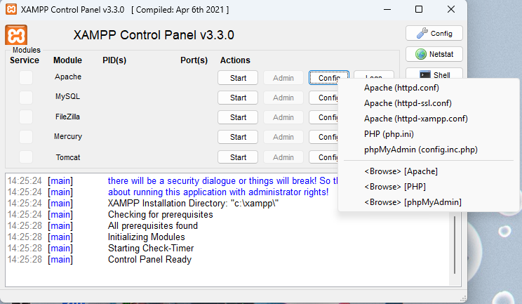.

Menghilangkan titik koma (;) pada ekstensi yang diaktifkan. lalu simpan kembali dan restart Apache web server.
##### 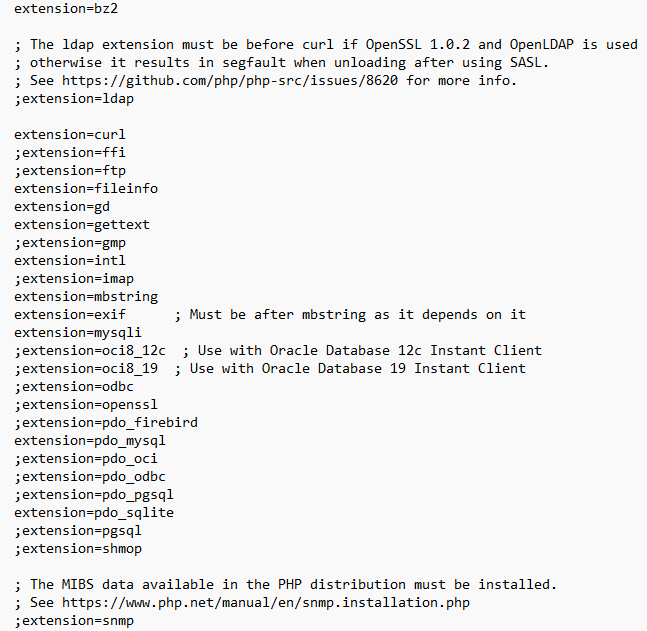.

Menginstall Codeigniter 4 dengan cara manual dan menggunakan Composer. setelah menginstall ubah ke extrak file zip Codeigniter ke direktori htdocs/lab11_ci. kemudian Ubah nama direktory framework-4.x.xx menjadi ci4. setelah langkah tadi dilakukan buka browser lalu ketik/salin http://localhost/lab11_ci/ci4/public/.
##### 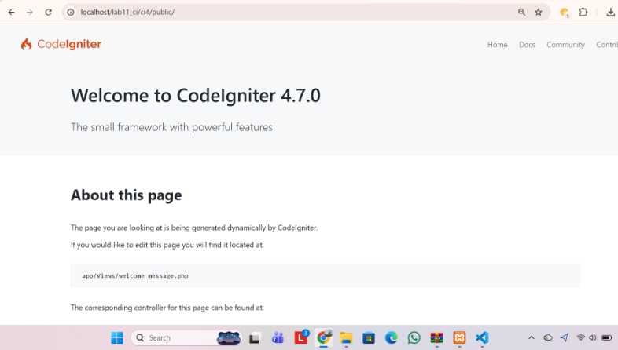.

Menjalankan CLI dengan memanggil php spark untuk mempermudah proses development. Caranya membuka terminal command prompt. lalu lokasi direktori diarahkan sesuai dengan direktori project yang dibuat.
##### 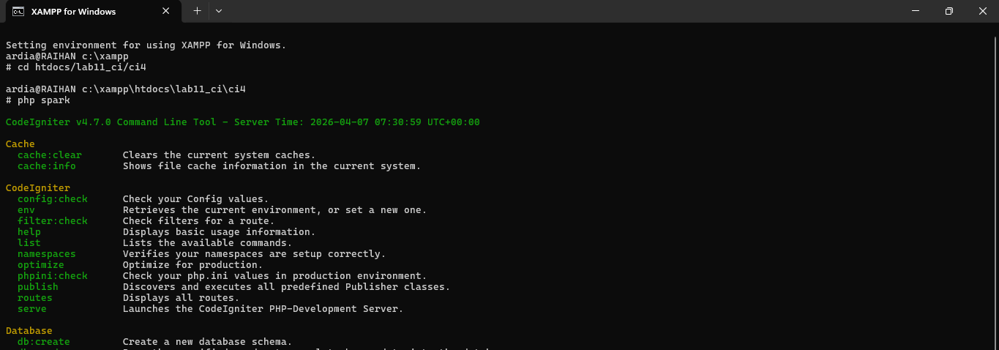.

Mengaktifkan mode debugging untuk memudahkan developer dalam mengetahui pesan error apabila terjadi kesalahan dalam kode program.
##### 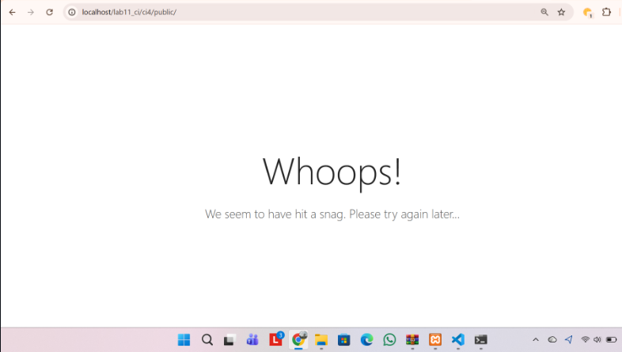.

Dengan cara mengubah nilai konfigurasi pada environment variable CI_ENVIRINMENT menjadi development.
##### .

Lalu ubah nama file env menjadi .env.
##### 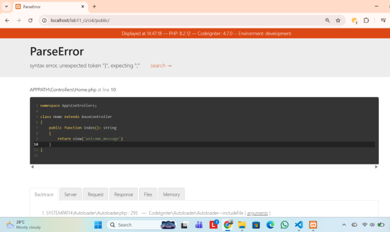.

Mencoba error dengan mengubah kode pada file app/Controller/Home.php dan hilangkan titik koma pada akhir kode.
##### 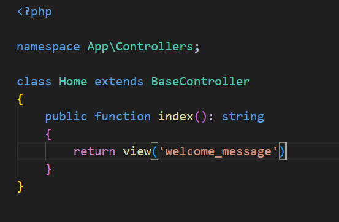.

Berikut adalah struktur direktorinya.
##### .

Router terletak pada file app/config/Routes.php.
##### 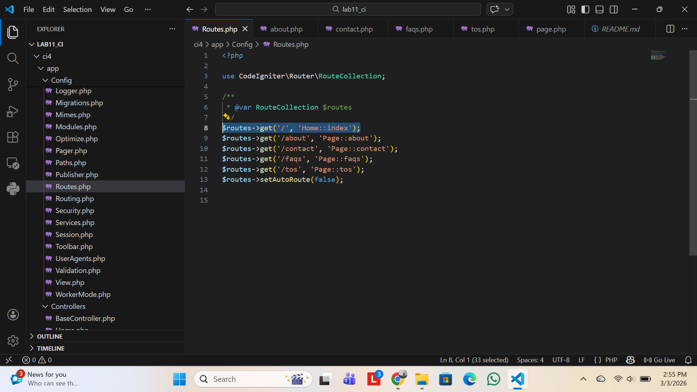.

Mendefinisikan route untuk aplikasi. seperti:
```php
$routes->get('/', 'Home::index');
```
Membuat route baru di dalam Routes.php:
```php
$routes->get('/about', 'Page::about');
$routes->get('/contact', 'Page::contact');
$routes->get('/faqs', 'Page::faqs');
```

Kemudian mengecek route apakah sudah benar dengan menjalankan perintah "php spark routes".
##### 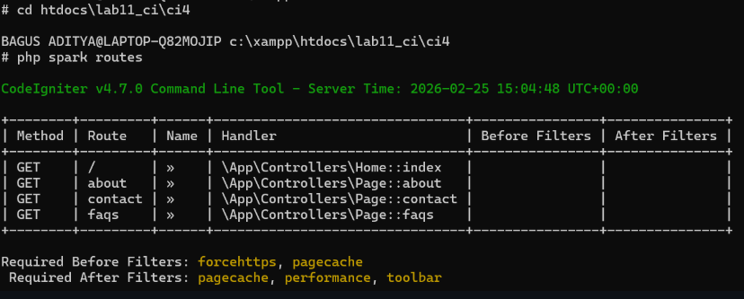.

Lalu akses alamat url yang telah dibuat tadi.
##### 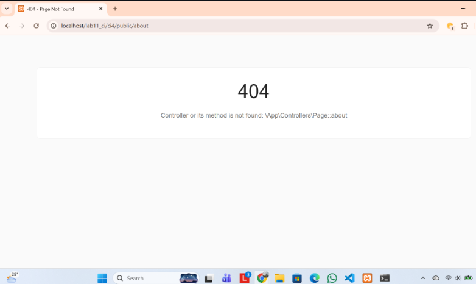.
Akan muncul tampilan error 404. untuk menanganinya dengan membuat Controller page dengan nama page.php pada direktori Controller. 
Lalu file tersebut diisi dengan kode yang telah diberikan.
##### .

Setelah itu kembali ke halaman yang sudah diakses tadi. maka akan muncul hasil sebagai berikut.
##### 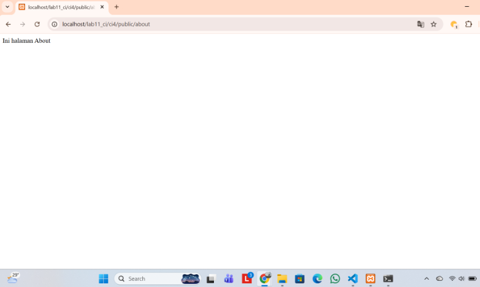.

Mengubah status autoroute dapat mengubah nilai variabelnya. Untuk menonaktifkan ubah nilai true menjadi false.
```php$routes->setAutoRoute(true);" - "$routes->setAutoRoute(false);```
lalu tambahkan method baru pada Controller Page seperti berikut.
```php
public function tos()
{
    echo "ini halaman Term of Services";
}
```

Kemudian akses halaman http://localhost/lab11_ci/ci4/tos.
##### 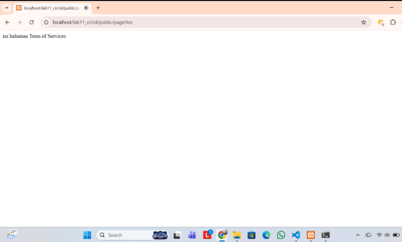.

Membuat View
Membuat file baru dengan nama about.php pada direktori view. kemudian isi kode yang telah diberikan.
```php
<!DOCTYPE html>
<html lang="en">
<head>
   <meta charset="UTF-8">
   <title><?= $title; ?></title>
</head>
<body>
   <h1><?= $title; ?></h1>
   <hr>
   <p><?= $content; ?></p>
</body>
</html>".
```

lalu mengubah method about menjadi seperti berikut:
```php
public function about()
    {
        return view('about', [
            'title'   => 'Halaman About',
            'content' => 'Ini adalah halaman about yang menjelaskan tentang isi halaman ini.'
        ]);
    }
```

kemudian refresh halaman yang tadi diakses.
##### 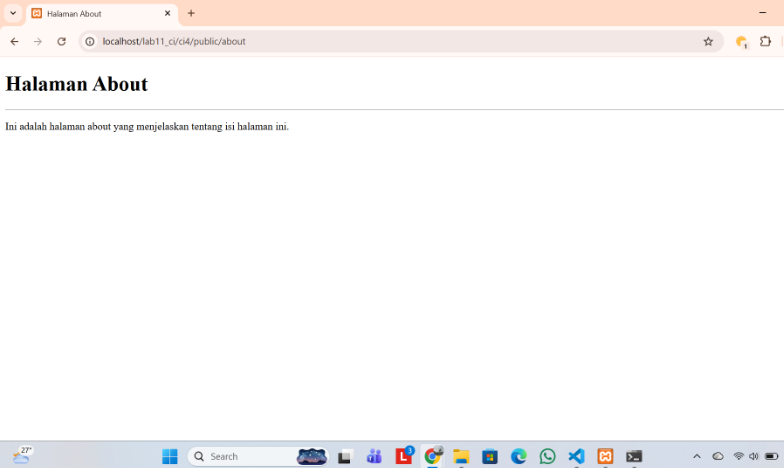.

Membuat layout CS pada direktori public dengan nama style.css.
##### 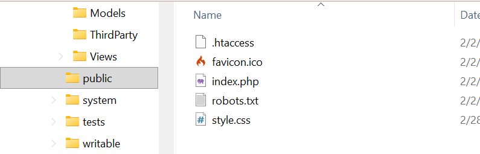.

Kemudian membuat folder template pada direktori view dan buat file header.php dan footer.php.
header.php:
##### .
footer.php
##### 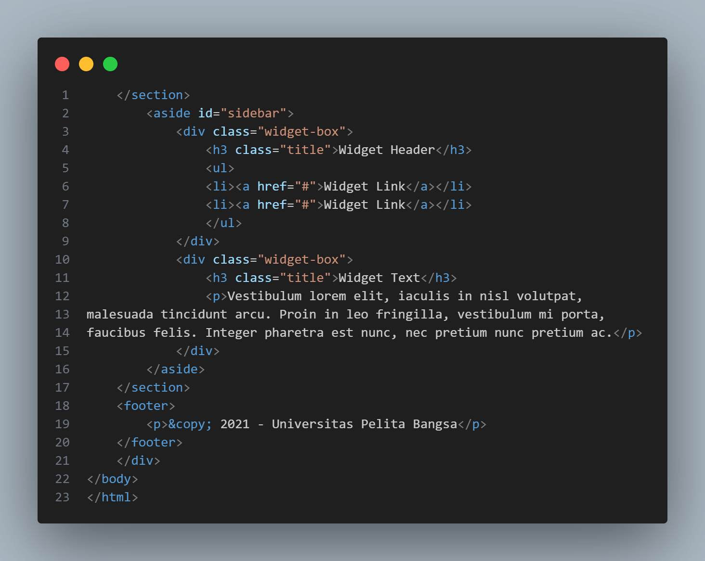.

lalu ubah file about dengan kode seperti berikut:
##### 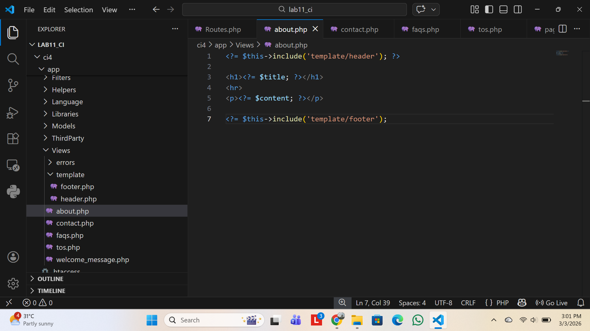.

lalu refresh kembali. maka hasil akan muncul seperti berikut.
##### 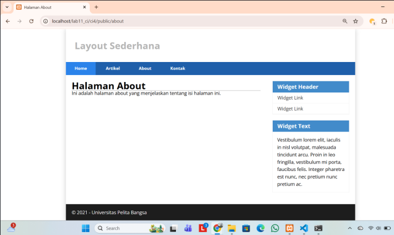.

## Pertanyaan dan Tugas
Lengkapi kode program untuk menu lainnya yang ada pada Controller Page, sehingga semua
link pada navigasi header dapat menampilkan tampilan dengan layout yang sama.
## Jawab
Membuat file artikel.php seperti yang ada pada navigasi di direktori views. lalu di isi dengan kode yang sama seperti di file about.php.
```php
<?= $this->include('template/header'); ?>

<h1><?= $title; ?></h1>
<hr>
<p><?= $content; ?></p>

<?= $this->include('template/footer');
```
Kemudian menambahkan kode seperti dibawah pada file page.php:
```php
public function artikel()
    {
        return view('artikel', [
            'title'   => 'Halaman Artikel',
            'content' => 'Ini halaman artikel.'
        ]);
    }
```

Kemudian tambahkan routes untuk artikel di dihalaman Routes.php.
```php
<?php

use CodeIgniter\Router\RouteCollection;

/**
 * @var RouteCollection $routes
 */
$routes->get('/', 'Home::index');
$routes->get('/artikel', 'Page::artikel');
$routes->get('/about', 'Page::about');
$routes->get('/contact', 'Page::contact');
```
Setelah menambahkan route untuk bagian artikel dan navigasi lainnya agar navigasinya ketika diklik akan terarah ke halaman artikel. maka jalankan perintah php spark serve di shell xampp.
##### 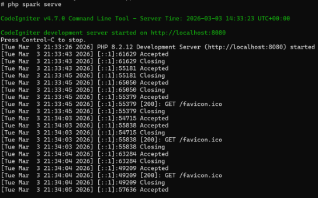.
Hasil akan muncul seperti gambar dibawah ini.
##### 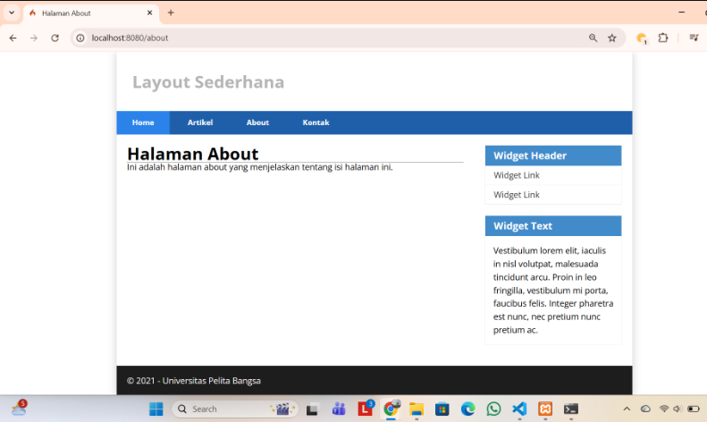.
##### 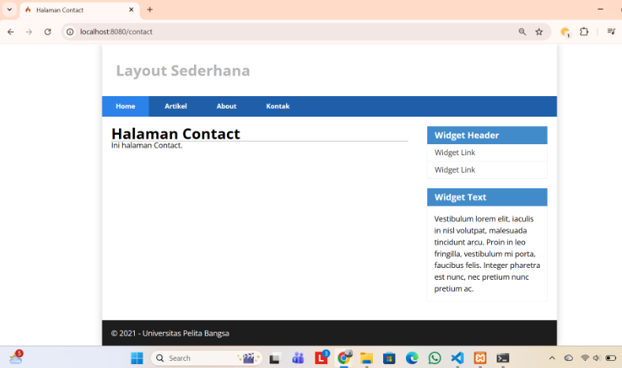.
##### 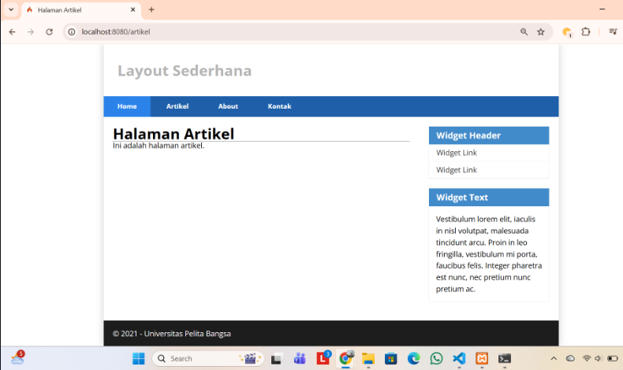.

## Langkah-Langkah Praktikum 2

#### Membuat database: studi kasus data artikel.
Membuat database dengan nama lab_ci4.
```
CREATE DATABASE lab_ci4;
```

Kemudian membuat tabel.
```
CREATE TABLE artikel (
 id INT(11) auto_increment,
 judul VARCHAR(200) NOT NULL,
 isi TEXT,
 gambar VARCHAR(200),
 status TINYINT(1) DEFAULT 0,
 slug VARCHAR(200),
 PRIMARY KEY(id)
);
```
#### Konfigurasi koneksi database
Membuat konfigurasi untuk menghubungkan dengan database server dengan menggunakan file .env.
##### 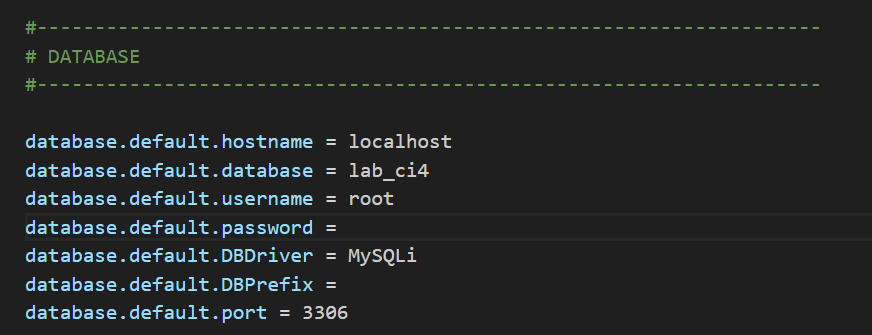.

#### Membuat model
Membuat model proses data artikel. dengan membuat file pada direktori app/Models dengan nama ArtikelModel.php. lalu isi dengan kode seperti berikut:
```php
<?php

namespace App\Models;

use CodeIgniter\Model;

Class ArtikelModel extends Model
{
    protected $table = 'artikel';
    protected $primarykey = 'id';
    protected $useAutoIncrement = true;
    protected $allowedFields = ['judul','isi', 'status', 'slug', 
'gambar'];

}
```

#### Membuat controller
Membuat Controller baru dengan nama Artikel.php pada direktori app/Controllers dan isi dengan kode seperti berikut:
```php
<?php

namespace App\Controllers;

use App\Models\ArtikelModel;

class Artikel extends BaseController
{
    public function index()
    {
        $title = 'Daftar Artikel';
        $model = new ArtikelModel();
        $artikel = $model->findAll();
        return view('artikel/index', compact('artikel', 'title'));
    }
```

#### Membuat view
Membuat view dengan file baru dengan nama index.php. isi dengan kode sebagai berikut:
```php
<?= $this->include('template/header'); ?>

<?php if($artikel): foreach($artikel as $row): ?>
<article class="entry">
    <h2><a href="<?= base_url('/artikel/' . $row['slug']);?>"><?=
$row['judul']; ?></a>
</h2>
    " alt="<?=
$row['judul']; ?>">
    <p><?= substr($row['isi'], 0, 200); ?></p>
</article>
<hr class="divider" />
<?php endforeach; else: ?>
<article class="entry">
    <h2>Belum ada data.</h2>
</article>
<?php endif; ?>

<?= $this->include('template/footer'); ?>
```
Lalu mencoba pada url yang telah diberikan yakni http://localhost:8080/artikel. hasil seperti gambar dibawah.
##### 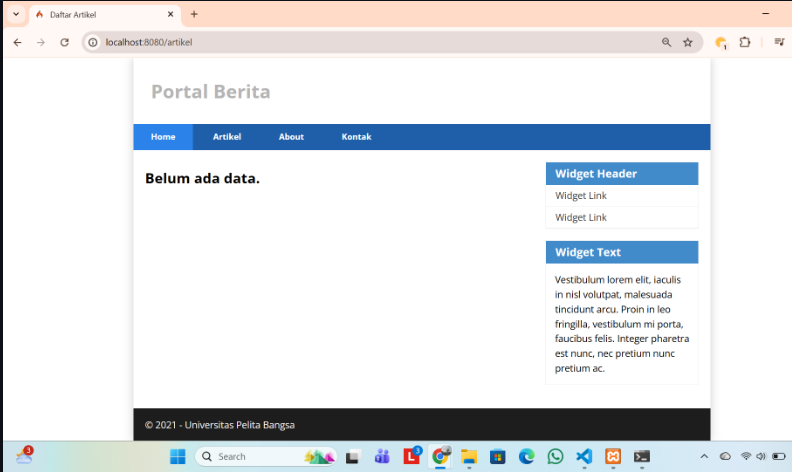.
Menambahkan data pada database.
```
INSERT INTO artikel (judul, isi, slug) VALUE
('Artikel pertama', 'Lorem Ipsum adalah contoh teks atau dummy dalam industri percetakan dan penataan huruf atau typesetting. Lorem Ipsum telah menjadi standar contoh teks sejak tahun 1500an, saat seorang tukang cetak yang tidak dikenal mengambil sebuah kumpulan teks dan mengacaknya untuk menjadi sebuah buku contoh huruf.', 'artikel-pertama'),
('Artikel kedua', 'Tidak seperti anggapan banyak orang, Lorem Ipsum bukanlah teks-teks yang diacak. Ia berakar dari sebuah naskah sastra latin klasik dari era 45 sebelum masehi, hingga bisa dipastikan usianya telah mencapai lebih dari 2000 tahun.', 'artikel-kedua');
```
Buka kembali halaman yang tadi lalu di refresh akan muncul data yang telan dimasukkan.
Hasil sebagai berikut:
##### 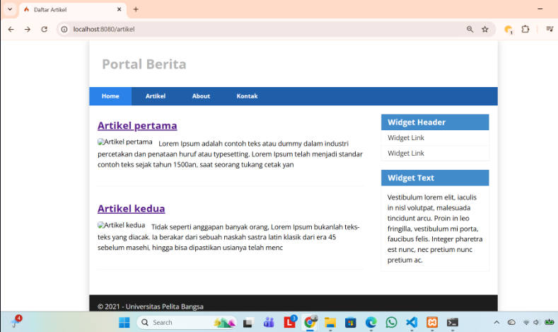.

#### Membuat tampilan detail artikel
Menambahkan fungsi baru pada Contorller Artikel dengan nama view(). isi dengan kode seperti berikut.
```php
public function view($slug)
    {
        $model = new ArtikelModel();
        $artikel = $model->where([
            'slug' => $slug
        ])->first();

        // Menampilkan error apabila data tidak ada.
        if (!$artikel)
        {
            throw PageNotFoundException::forPageNotFound();
        }
        $title = $artikel['judul'];
        return view('artikel/detail', compact('artikel', 'title'));
    }
```

#### Membuat view detail
Membuat view baru pada app/views/artikel dengan nama detail.php. isi file dengan kode sebagai berikut.
```php
<?= $this->include('template/header'); ?>

<article class="entry">
    <h2><?= $artikel['judul']; ?></h2>
    " alt="<?=
$artikel['judul']; ?>">
    <p><?= $artikel['isi']; ?></p>
</article>

<?= $this->include('template/footer'); ?>
```

#### Membuat routing untuk artikel data
Tambahkan routing pada Routes.php.
```php$routes->get('/artikel/(:any)', 'Artikel::view/$1');```.
##### 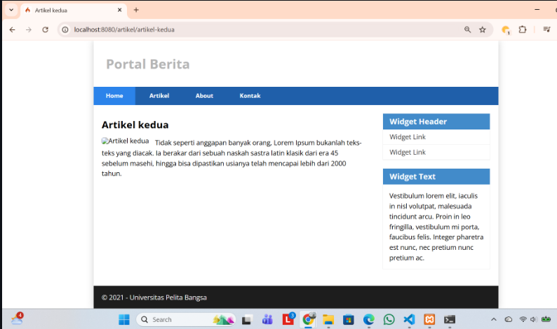.

#### Membuat menu admin
Membuat method baru pada Controller Artikel dengan nama admin_index(). isi dengan kode sebagai berikut:
```php
public function admin_index()
    {
        $title = 'Daftar Artikel';
        $model = new ArtikelModel();
        $artikel = $model->findALL();
        return view('artikel/admin_index', compact('artikel', 'title'));
    }
```
Membuat view admin dengan nama admin_index.php.
```php
<?= $this->include('template/admin_header'); ?>

<table class="table">
    <thead>
        <tr>
            <th>ID</th>
            <th>Judul</th>
            <th>Status</th>
            <th>Aksi</th>
        </tr>
    </thead>
    <tbody>
    <?php if($artikel): foreach($artikel as $row): ?>
    <tr>
        <td><?= $row['id']; ?></td>
        <td>
            <b><?= $row['judul']; ?></b>
            <p><small><?= substr($row['isi'], 0, 50); ?></small></small></p>
        </td>
        <td><?= $row['status']; ?></td>
        <td>
            <a class="btn" href="<?= base_url('/admin/artikel/edit/' .
$row['id']);?>">Ubah</a>
            <a class="btn btn-danger" onclick="return confirm('Yakin
menghapus data?');" href="<?= base_url('/admin/artikel/delete/' .
$row['id']);?>">Hapus</a>
        </td>
    </tr>
    <?php endforeach; else: ?>
    <tr>
        <td colspan="4">Belum ada data</td>
    </tr>
    <?php endif; ?>
    </tbody>
    <tfoot>
        <tr>
            <th>ID</th>
            <th>Judul</th>
            <th>Status</th>
            <th>Aksi</th>
        </tr>
    </tfoot>
</table>

<?= $this->include('template/admin_footer'); ?>
```

Menambahkan routing menu admin:
```
$routes->group('admin', function($routes) {
    $routes->get('artikel', 'Artikel::admin_index');
    $routes->add('artikel/add', 'Artikel::add');
    $routes->add('artikel/edit/(:any)', 'Artikel::edit/$1');
    $routes->get('artikel/delete/(:any)', 'Artikel::delete/$1');
});
```
Akses menu admin dengan url http://localhost:8080/admin/artikel.

##### 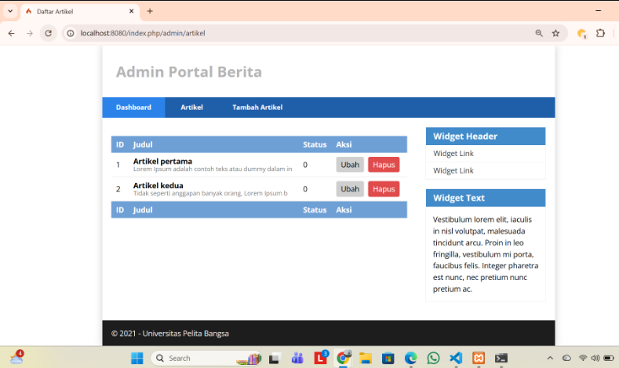.

#### Menambah data artikel
Menambahkan fungis dengan nama add() pada Controller Artikel.
```php
public function add()
    {
        // validasi data.
        $validation = \Config\Services::validation();
        $validation->setRules(['judul' => 'required']);
        $isDataValid = $validation->withRequest($this->request)->run();

        if ($isDataValid)
        {
            $artikel = new ArtikelModel();
            $artikel->insert([
                'judul' => $this->request->getPost('judul'),
                'isi' => $this->request->getPost('isi'),
                'slug' => url_title($this->request->getPost('judul')),
            ]);
            return redirect('admin/artikel');
        }
        $title = "Tambah Artikel";
        return view('artikel/form_add', compact('title'));
    }
```

Lalu membuat view form tambah dengan nama form_add.php.
```php
<?= $this->include('template/admin_header'); ?>

<h2><?= $title; ?></h2>
<form action="" method="post">
    <p>
    <input type="text" name="judul">
    </p>
    <p>
    <textarea name="isi" cols="50" rows="10"></textarea>
    </p>
    <p><input type="submit" value="Kirim" class="btn btn-large"></p>
</form>

<?= $this->include('template/admin_footer'); ?>
```

Kemudian akses http://localhost:8080/admin/artikel/add.
##### 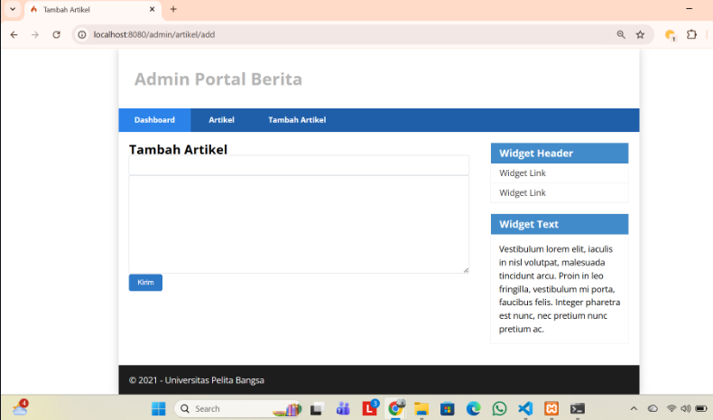.

#### Mengubah data
Menambahkan fungsi pada Artikel.php dengan nama edit().
```php
public function edit($id)
    {
        $artikel = new ArtikelModel();
        // validasi data.
        $validation = \Config\Services::validation();
        $validation->setRules(['judul' => 'required']);
        $isDataValid = $validation->withRequest($this->request)->run();
        
        if ($isDataValid)
        {
            $artikel->update($id, [
                'judul' => $this->request->getPost('judul'),
                'isi' => $this->request->getPost('isi'),
            ]);
            return redirect('admin/artikel');
        }
        
        // ambil data lama
        $data = $artikel->where('id', $id)->first();
        $title = "Edit Artikel";
        return view('artikel/form_edit', compact('title', 'data'));
    }
```

Kemudian membuat view untuk form edit dengan nama form_edit.php
```php
<?= $this->include('template/admin_header'); ?>

<h2><?= $title; ?></h2>
<form action="" method="post">
    <p>
        <input type="text" name="judul" value="<?= $data['judul'];?>" >
    </p>
    <p>
        <textarea name="isi" cols="50" rows="10"><?=
$data['isi'];?></textarea>
    </p>
    <p><input type="submit" value="Kirim" class="btn btn-large"></p>
</form>

<?= $this->include('template/admin_footer'); ?>
```
Hasil akan seperti berikut:
##### 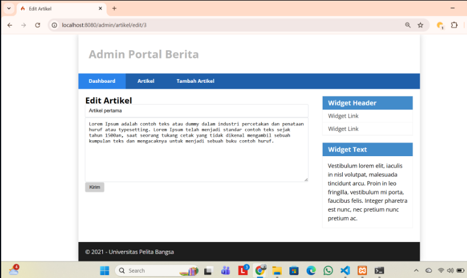.

#### Menghapus data 
Menambahkan funsgi delete pada Artikel.php dengan nama delete().
```php
public function delete($id)
    {
        $artikel = new ArtikelModel();
        $artikel->delete($id);
        return redirect('admin/artikel');
    }
```

## Pertanyaan dan Tugas
Selesaikan programnya sesuai Langkah-langkah yang ada. Anda boleh melakukan improvisasi.
1. Kolom pencarian
```php
<form method="get">
    <input type="text" name="keyword" placeholder="Cari artikel">
    <button type="submit">Cari</button>
</form>
```
Kode ini untuk membuat kolom pencarian agar artikel yang telah dibuat dapat dicari dengan cepat.
##### 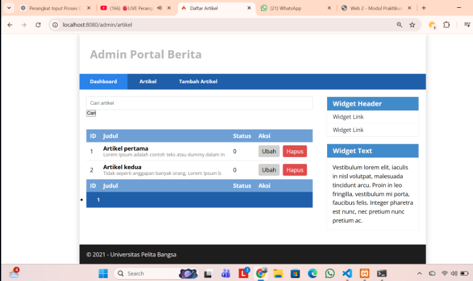.

2. Pagination
```php
<?= $pager->links(); ?>
```
Kode ini untuk membuat setiap page agar artikel dapat tersusun rapih.
##### 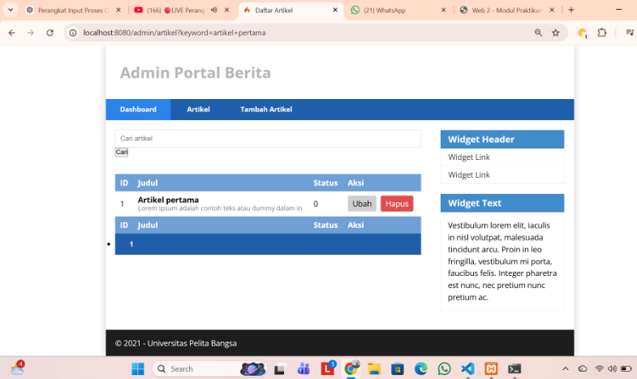.

3. Tombol kembali pada edit artikel
##### 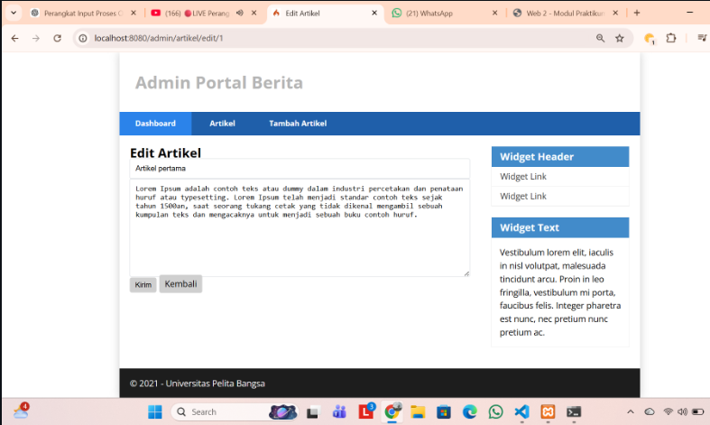.

4. Tombol kembali pada tambah artikel
##### 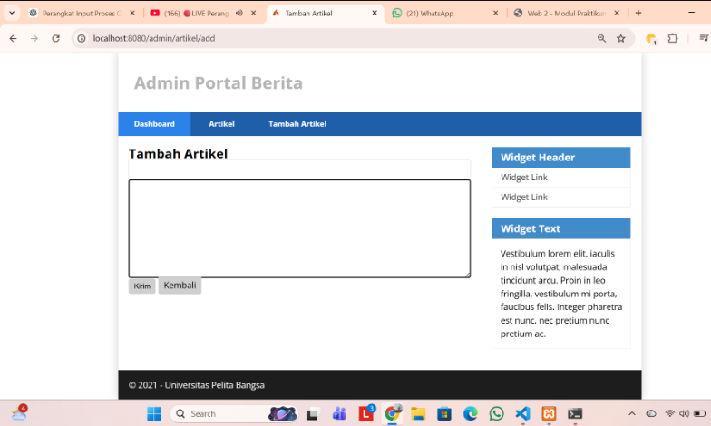.


## Langkah-Langkah Praktikum 3

#### Membuat layout utama
Membuat folder layout dan file pada folder tersebut dengan nama main.php lalu isi kode seperti berikut.
```php
<!DOCTYPE html>
<html lang="en">
<head>
    <meta charset="UTF-8">
    <title>Document</title>
    <link rel="stylesheet" href="<?= base_url('/style.css');?>">
</head>
<body>
    <div id="container">
        <header>
            <h1>Layout Sederhana</h1>
        </header>
        <nav>
            <a href="<?= base_url('/');?>" class="active">Home</a>
            <a href="<?= base_url('/artikel');?>">Artikel</a>
            <a href="<?= base_url('/about');?>">About</a>
            <a href="<?= base_url('/contact');?>">Kontak</a>
        </nav>
        <section id="wrapper">
            <section id="main">
                <?= $this->renderSection('content') ?>
            </section>
            <aside di="sidebar">
                <?= view_cell('App\\Cells\\ArtikelTerkini::render') ?>
                <div class="widget-box">
                    <h3 class="title">Widget Header</h3>
                    <ul>
                        <li><a href="#">Widget Link</a></li>
                        <li><a href="#">Widget Link</a></li>
                    </ul>
                </div>
                <div class="widget-box">
                    <h3 class="title"></h3>
                    <p>
                        Vestibulum lorem elit, iaculis in nisl volutpat,
                            malesuada tincidunt arcu. Proin in leo fringilla,
vestibulum mi porta,
                        faucibus felis. Integer pharetra est nunc, nec pretium
nunc pretium ac.</p>
                </div>
            </aside>
        </section>
        <footer>
            <p>&copy; 2021 - Universitas Pelita Bangsa</p>
        </footer>
    </div>
</body>
</html>
```

Hasil:
##### 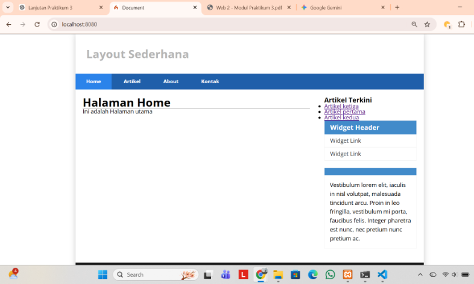.

#### Membuat file view
Mengubah file home.php:
```php
<?= $this->extend('layout/main') ?>

<?= $this->section('content') ?>

<h1><?= $title; ?></h1>
<hr>
<p><?= $content; ?></p>

<?= $this->endSection() ?>
```

#### Membuat class view cell
Membuta folder Cells di dalam app/. lalu buat artikelTerkini.php di dalam folder yang telah dibuat. masukan kode seperti berikut:
```php
<?php

namespace App\Cells;

use CodeIgniter\View\Cell;
use App\Models\ArtikelModel;

class ArtikelTerkini extends Cell
{
    public function render()
    {
        $model = new ArtikelModel();
        $artikel = $model->orderBy('tanggal', 'DESC')->limit(5)->findALL();

        return view('components/artikel_terkini', ['artikel' => $artikel]);
    }
}
```

#### Membuat view untuk view cell
Membuat folder component didalam app/Views lalu buat file artikel_terkini.php dengan kode sebagai berikut:
```php
<h3>Artikel Terkini</h3>
<ul>
    <?php foreach ($artikel as $row): ?>
        <li><a href="<?= base_url('/artikel/' . $row['slug']) ?>"><?=
$row['judul'] ?></a></li>
    <?php endforeach; ?>
</ul>
```

# Pertanyaan dan tugas
• Sesuaikan data dengan praktikum sebelumnya, perlu melakukan perubahan field pada
database dengan menambahkan tanggal agar dapat mengambil data artikel terbaru.
```php
$artikel = $model
        ->orderBy('tanggal', 'DESC')
        ->limit(5)
        ->findAll();
```
Kode ini berfungsi untuk mengurutkan data berdasarkan tanggal terbaru dan membatasi jumlah data yang ditampilkan. Dan menambahkan kolom tanggal pada tabel database.
##### .
Pada gambar diatas data artikel berurutan sesuai dengan tanggal dimana artikel tersebut sesuai dengan tanggal terbaru.
• Selesaikan programnya sesuai Langkah-langkah yang ada. Anda boleh melakukan
improvisasi. Hasil langkah-langkah ada di bagian atas.
• Apa manfaat utama dari penggunaan View Layout dalam pengembangan aplikasi?
```
1. Meningkatkan pengalaman UI/UX.
2. Struktur yang rapih.
3. Tampilan menjadi lebih efisien.
4. Membantu aplikasi lebih responsif.
```
• Jelaskan perbedaan antara View Cell dan View biasa.
Perbedaan antara view cell dan View biasa adalah kalau View biasa itu ketika dipanggil harus melalui controller dan tidak fleksibel ketika dipakai dibanyak halaman. sedangkan View Cell ini tanpa memerlukan Controller yang banyak, fleksibel, dan bisa dipakai berulang.
<br>
• Ubah View Cell agar hanya menampilkan post dengan kategori tertentu.
```php
<?php

namespace App\Cells;

use App\Models\ArtikelModel;

class ArtikelTerkini 
{
    public function index()
    {
        $model = new ArtikelModel();

        $data = $model
            ->where('kategori IS NOT NULL')
            ->where('kategori !=', '')
            ->orderBy('tanggal', 'DESC')
            ->findAll();
        $grouped = [];

        foreach ($data as $row) {
            $kategori = $row['kategori'] ?? 'Lainnya';
            $grouped[$kategori][] = $row;
        }

        return view('components/artikel_terkini', [
            'grouped' => $grouped
        ]);
    }
}
```
Dari kode diatas berfungsi untuk memfilter artikel berdasarkan kategori tertentu. Data yang diambil akan ditampilkan pada View Cell.

Mengubah tampilan view/artikel_terkini.php agar tampil perkategori.
```php
<div class="widget-box">
    <h3 class="title">Artikel Terkini</h3>

    <?php foreach ($grouped as $kategori => $items): ?>
        
        <h4><?= $kategori ?></h4>
        <ul>
            <?php foreach ($items as $row): ?>
                <li>
                    <a href="<?= base_url('/artikel/' . $row['slug']) ?>">
                        <?= $row['judul'] ?>
                    </a>
                </li>
            <?php endforeach; ?>
        </ul>

    <?php endforeach; ?>
</div>
```

Hasil:
##### 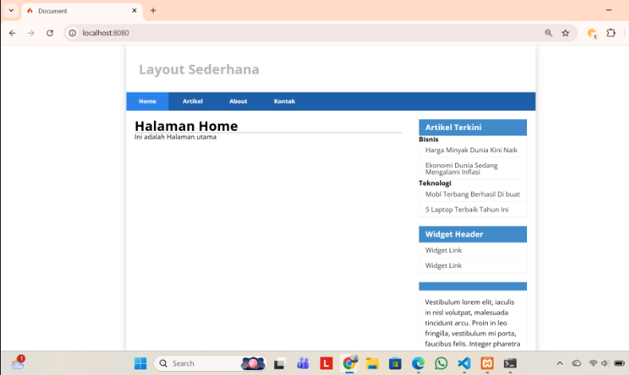.


## Langkah-Langkah Praktikum 4

### Pada praktikum ini dilakukan pengembangan sistem dengan menambahkan fitur login, keamanan halaman admin, serta penambahan kategori pada artikel.

#### Membuat tabel user login
Sistem login dibuat untuk membatasi akses ke halaman admin. Data user disimpan dalam tabel user yang berisi username, email, dan password yang sudah dienkripsi (hash). Menyiapkan MySQL terlebih dahulu dan menjalankan servernya. lalu buat tabel user.
```
CREATE TABLE user (
 id INT(11) auto_increment,
 username VARCHAR(200) NOT NULL,
 useremail VARCHAR(200),
 userpassword VARCHAR(200),
 PRIMARY KEY(id)
);
```

#### Membuat model user
Membuat file baru di direktori app/Models dengan nama UserModel.php.
```php
<?php
namespace App\Models;
use CodeIgniter\Model;
class UserModel extends Model
{
     protected $table = 'user';
     protected $primaryKey = 'id';
     protected $useAutoIncrement = true;
     protected $allowedFields = ['username', 'useremail', 'userpassword'];
}
```

#### Membuat Controller User
Membuat cotroller baru dengan nama User.php di direktori app/Controllers. lalu menambahkan method index() untuk menampilkan daftar user,  dan method login() untuk proses login.
```php
<?php
namespace App\Controllers;

use App\Models\UserModel;

class User extends BaseController
{
    public function index()
    {
        $title = 'Daftar user';
        $model = new UserModel();
        $users = $model->findAll();
        return view('user/index', compact('users', 'title'));
    }

    public function login()
    {
        helper(['form']);
        $email = $this->request->getPost('email');
        $password = $this->request->getPost('password');
        if (!$email)
        {
            return view('user/login');
        }

        $session = session();
        $model = new UserModel();
        $login = $model->where('useremail', $email)->first();
        if ($login)
        {
            $pass = $login['userpassword'];
            if (password_verify($password, $pass))
            {
                $login_data = [
                    'user_id' => $login['id'],
                    'user_name' => $login ['username'],
                    'user_email' => $login ['useremail'],
                    'logged_in' => TRUE,
                ];

                $session->set($login_data);
                return redirect('admin/artikel');
            }
            else
            {
                $session->setFlashdata("flash_msg", "Password salah.");
                return redirect()->to('/user/login');
            }
        }
        else
        {
            $session->setFlashdata("flash_msg", "email tidak terdaftar.");
            return redirect()->to('/user/login');
        }
    }

    public function logout()
    {
        session()->destroy();
        return redirect()->to('/user/login');
    }
}
```

#### Membuat Vew login
Membuat direktori baru dengan nama user pada direktori app/Views dan buat file dengan nama login.php
```html
<!DOCTYPE html>
<html lang="en">
<head>
    <meta charset="UTF-8">
    <title>Login</title>
    <link rel="stylesheet" href="<?= base_url('/style.css');?>">
</head>
<body>
    <div id="login-wrapper">
            <h1>Sign In</h1>
            <?php if(session()->getFlashdata('flash_msg')):?>
                <div class="alert alert-danger"><?= session()->getFlashdata('flash_msg') ?></div>
            <?php endif;?>
            <form action="" method="post">
                <div class="mb-3">
                    <label for="InputForEmail" class="form-label">Email
address</label>
                    <input type="email" name="email" class="form-control"
id="InputForEmail" value="<?= set_value('email') ?>">
                </div>
                <br>
                <div class="mb-3">
                    <label for="InputForPassword" class="form-
label">Password</label>
                    <input type="password" name="password" class="from-
control" id="InputForPassword">
                </div>
                <br>
                <button type="submit" class="btn btn-
primary">Login</button>
    </div>
</body>
</html>
```

#### Membuat database seeder
Membuat database seeder yang digunakan untuk membuat data dummy dan untuk keperluan ujicoba modul login. masukkan data user dan password kedalam database. jalankan database seeder di CLI pada xampp.
```php spark make:seeder UserSeeder```

Lalu buka file UserSeeder.php di direktori /app/Database/Seeds/UserSeeder.php dan isi dengan kode sebagai berikut.
```php
<?php

namespace App\Database\Seeds;

use CodeIgniter\Database\Seeder;

class UserSeeder extends Seeder
{
    public function run()
    {
        $model = model('UserModel');
        $model->insert([
            'username' => 'admin',
            'useremail' => 'admin@email.com',
            'userpassword' => password_hash('admin123', PASSWORD_DEFAULT),
        ]);
    }
}
```

Ketik kembali di CLI dengan perintah sebagai berikut:
```php spark db:seed UserSeeder```

#### Uji Coba Login

Buka url  http://localhost:8080/user/login. hasil akan sebagai berikut:
##### 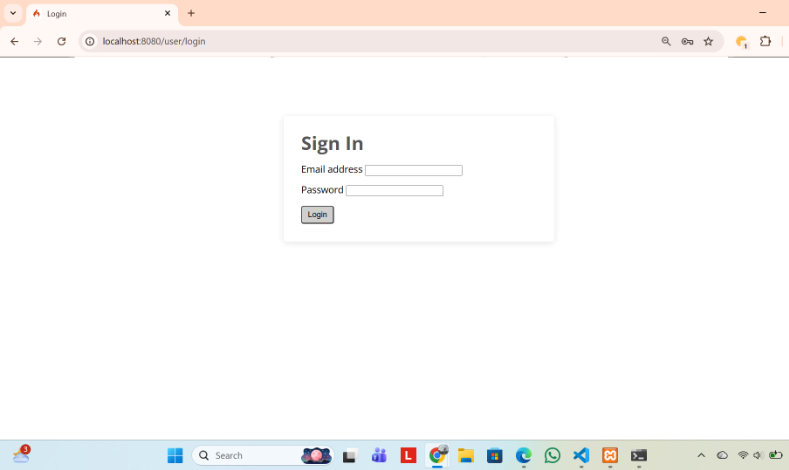.

#### Menambahkan Auth Filter
Membuat filter untuk halaman admin. Buat file baru dengan nama Auth.php di direktori app/Filters. isi dengan kode sebagai berikut.
```php
<?php namespace App\Filters;

use CodeIgniter\HTTP\RequestInterface;
use CodeIgniter\HTTP\ResponseInterface;
use CodeIgniter\Filters\FilterInterface;

class Auth implements FilterInterface
{
    public function before(RequestInterface $request, $arguments = null)
    {
        // jika user belum login
        if(! session()->get('logged_in')){
            // maka redirct ke halaman login
            return redirect()->to('/user/login');
        }
    }

    public function after(RequestInterface $request, ResponseInterface
$response, $arguments = null)
    {
        // Do something here
    }
}
```

Buka file app/Config/Filters.php dana menambahkan kode sebagai berikut.
```'auth' => App\Filters\Auth::class```

```php
public array $aliases = [
        'csrf'          => CSRF::class,
        'toolbar'       => DebugToolbar::class,
        'honeypot'      => Honeypot::class,
        'auth'          => \App\Filters\Auth::class,
        'invalidchars'  => InvalidChars::class,
        'secureheaders' => SecureHeaders::class,
        'cors'          => Cors::class,
        'forcehttps'    => ForceHTTPS::class,
        'pagecache'     => PageCache::class,
        'performance'   => PerformanceMetrics::class,
    ];
```

Kemudian buka file app/Config/Routes.php dan sesuaikan kodenya
```php
$routes->get('/artikel/(:any)', 'Artikel::view/$1');
$routes->group('admin', ['filter' => 'auth'], function($routes) {
    $routes->get('artikel', 'Artikel::admin_index');
    $routes->add('artikel/add', 'Artikel::add');
    $routes->add('artikel/edit/(:any)', 'Artikel::edit/$1');
    $routes->get('artikel/delete/(:any)', 'Artikel::delete/$1');
});
```

#### Percobaan akses menu admin
Membuka url alamat http://localhost:8080/admin/artikel. halaman tersebut ketika diakses akan tampak hasil sebagai berikut:
##### 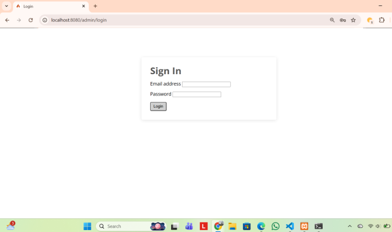.

#### Fungsi logout
Menambahkan method lagout pada Controller User seperti dibawah:
```php
public function logout()
    {
        session()->destroy();
        return redirect()->to('/user/login');
    }
```

Saya menambahkan tombol logout pada halaman dashboard admin dan user.
##### 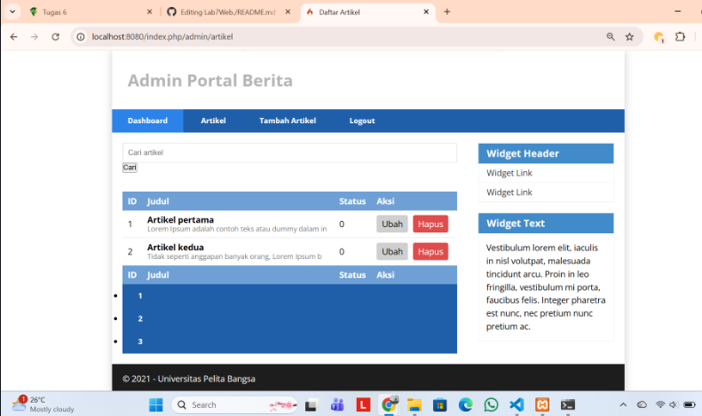.
##### 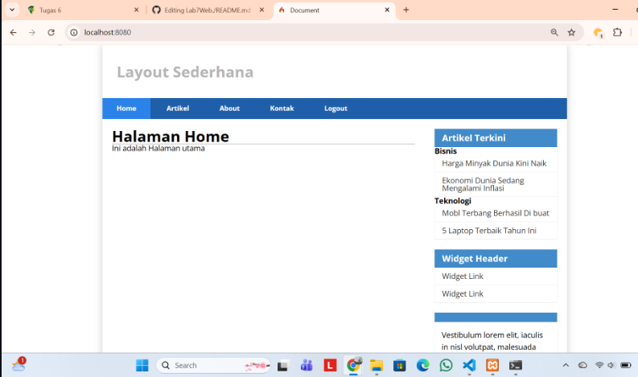.

Lalu saya membuat kolom kategori pada tambah artikel.
Input:
```php
<p>
    <input type="text" name="kategori" placeholder="Kategori">
</p>
```

Output:
##### 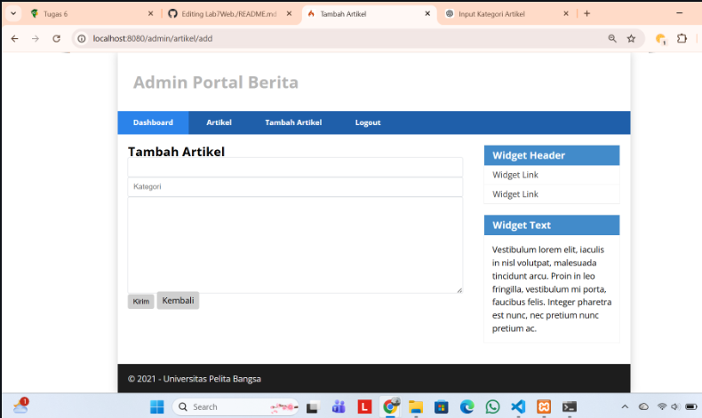.
